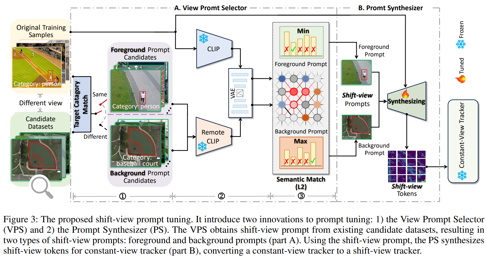
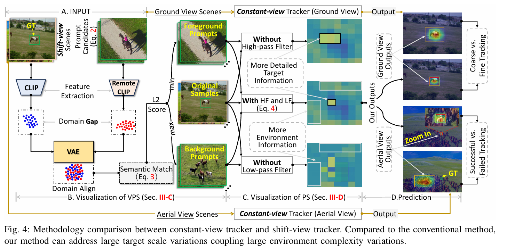

# Adapting Visual Trackers to Dynamic View Transitions with Shift-view Prompt Tuning
# Abstract
Visual tracking is essential for intelligent transportation systems and autonomous driving.
However, most conventional state-of-the-art visual trackers are designed for constant-view scenarios with fixed camera viewpoints, and they only achieve satisfactory performance under stable visual features scenarios.
In reality, visual tracking often encounters shift-view scenarios, where cameras' dynamic view transitions between ground and aerial views. 
These shifts lead to large variations in target scale and environmental complexity, resulting in inconsistent visual feature that ultimately degrade the robustness of conventional  visual trackers.
Although developing a dedicated tracker for such shift-view scenarios is possible, it requires  expensive temporal and computational costs.
To address this challenge, we propose Shift-view Prompt Tuning, a cost-efficient method that enables conventional trackers to handle dynamic view transitions.
We use sample pairs from different view datasets as prompts to guide the tracker’s adaptation. By embedding distinctive visual information from these prompts into training samples, we help the tracker learn about dynamic view transitions without requiring it to be relearned from scratch. 
This approach seamlessly transforms any constant-view trackers into shift-view trackers.
Our extensive experiments on 14 datasets with 3 different view types show that our approach significantly enhances tracking performance.
This advancement extends the application scope of current trackers and offers a robust solution for multi-view traffic monitoring and vehicle tracking in intelligent transportation systems.
The code will be available at \href{https://github.com/anonymous-SPT}{here}.
#  Methodology

<p align="center">
  
</p>

<p align="center">
  
</p>

# Usage
## Installation
Create and activate a conda environment:
```
conda create -n SPTrack python=3.11
conda activate SPTrack
```

Install the required packages:
```
pip install -r requirement.txt
```

## Data Preparation
Put the tracking datasets in ./data. It should look like:
   ```
   ${PROJECT_ROOT}
    -- data
        -- lasot
            |-- airplane
            |-- basketball
            |-- bear
            ...
        -- got10k
            |-- test
            |-- train
            |-- val
        -- coco
            |-- annotations
            |-- images
        -- trackingnet
            |-- TRAIN_0
            |-- TRAIN_1
            ...
            |-- TRAIN_11
            |-- TEST
	-- candidatedatasets
   ```

## Path Setting
Run the following command to set paths:
```
cd <PATH_of_SPTrack>
python tracking/create_default_local_file.py --workspace_dir . --data_dir ./data --save_dir ./output
```
You can also modify paths by these two files:
```
./lib/train/admin/local.py  # paths for training
./lib/test/evaluation/local.py  # paths for testing
```
# Visual comparisons
<div align=center>
	
</div>
