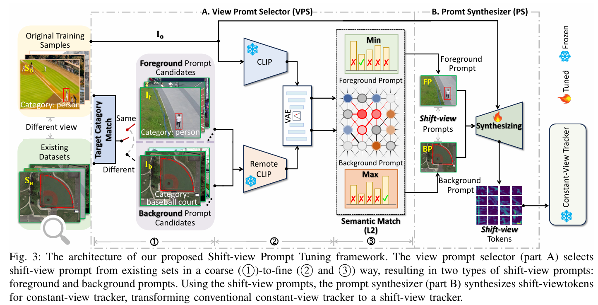

# Shift-view Prompt Tuning: A Novel Training Pipeline for Visual Tracking
# Abstract
Most SOTA visual trackers are constant-view trackers, $i.e.$,they are designed for tracking scenarios collected from fixed-view cameras. However, when they are applied to shift-view tracking scenarios, their effectiveness is limited, primarily due to the significant differences between the two scenarios, particularly in terms of target scale variations and environmental complexity variations. This limitation stems from the conventional offline training approaches, which solely collect constant-view data to train existing visual trackers, making them difficult to adapt for shift-view tracking scenarios. 
Thus, we propose a novel training approach called Shift-view Prompt Tuning, which introduces shift-view prompts that adapt trackers to shift-view tracking scenarios in a cost-effective way. Our method consists of two components: the View Prompt Selector (VPS) and the Prompt Synthesizer (PS). The VPS generates powerful shift-view prompts from existing different view candidate datasets by leveraging invariant target semantic information across different view data. The PS synthesizes shift-view tokens using shift-view prompts, facilitating trackers’ adaptability for shift-view tracking scenarios. Extensive experiments on different tracking datasets demonstrate our proposed method’s effectiveness, efficiency, and strong generalization capabilities.
#  Methodology

<p align="center">
  
</p>

<p align="center">
  
</p>

# Usage
## Installation
Create and activate a conda environment:
```
conda create -n SPTrack python=3.11
conda activate SPTrack
```

Install the required packages:
```
pip install -r requirement.txt
```

## Data Preparation
Put the tracking datasets in ./data. It should look like:
   ```
   ${PROJECT_ROOT}
    -- data
        -- lasot
            |-- airplane
            |-- basketball
            |-- bear
            ...
        -- got10k
            |-- test
            |-- train
            |-- val
        -- coco
            |-- annotations
            |-- images
        -- trackingnet
            |-- TRAIN_0
            |-- TRAIN_1
            ...
            |-- TRAIN_11
            |-- TEST
	-- candidatedatasets
   ```

## Path Setting
Run the following command to set paths:
```
cd <PATH_of_SPTrack>
python tracking/create_default_local_file.py --workspace_dir . --data_dir ./data --save_dir ./output
```
You can also modify paths by these two files:
```
./lib/train/admin/local.py  # paths for training
./lib/test/evaluation/local.py  # paths for testing
```
# Visual comparisons
<div align=center>
	
</div>
